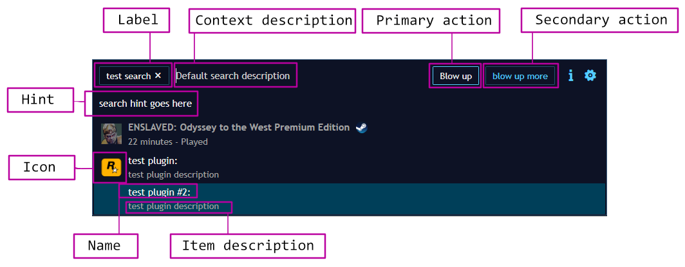

Global search support
=====================

Introduction
---------------------

Playnite 10 introduced new global search that can be used to search for games and commands throughout the application. Extensions (only plugins specifically) can provide custom search support to this view, in two ways:

- By overriding `GetSearchGlobalCommands` method in a plugin class.
- Providing custom search contexts.

Playnite also automatically includes extension menu items in default search. For both global command search (main menu items are included) and for game commands (game menu items are included). Menu item requests methods now provide `IsGlobalSearchRequest` property which indicates whether menu item request is done for standard menus or for global search, in case you would want to return different items based on that context.

Search contexts
---------------------

To provide new search context, return search support entries via [Searches](xref:Playnite.SDK.Plugins.Plugin.Searches) property from your plugin class.

[SearchSupport](xref:Playnite.SDK.Plugins.SearchSupport) properties:

| Property | Description |
| --- | --- |
| DefaultKeyword | Default keyword a user would need to use to switch to this context (users can set custom keyword in Playnite's settings). |
| Name | Search name displayed when browsing available searches. |
| Context| Search context Playnite will switch to when related search keyword is used. |

### Implementing search context

Search results are provided by implementing `GetSearchResults` method on context class. The method is called when search switches to the context and every time search query changes (users types something in).

By default `GetSearchResults` is called for every query change instantly, which means it gets instantly called as user types in, letter by letter. If your search is "expensive" and you don't want it to be executed immediately, you can set `Delay` property on your search context which will delay search execution by specified amount of milliseconds. For example, setting it to `200` will mean that `GetSearchResults` method will be executed 200 millisecond after last query change (in practice 200 milliseconds after a user stopped typing).

> [!WARNING]
> `GetSearchResults` method is executed on background thread. This means that some thread safety limitations apply to using SDK from this method. See [this page](plugins.md#accessing-playnite-api) for more information.

Items returned from `GetSearchResults` can be either [SearchItem](xref:Playnite.SDK.Plugins.SearchItem) or [GameSearchItem](xref:Playnite.SDK.Plugins.GameSearchItem). They both have the same functionality, the only difference is how they are displayed in search results.

[SearchContext](xref:Playnite.SDK.Plugins.SearchContext) properties:

| Property | Description |
| --- | --- |
| Description | Search context description. |
| Hint | Search hint text shown if users presses [F1] or uses search help button. |
| Label | Search context label. |
| Delay | Delay in millisecond before search method is executed after user stops typing. |
| UseAutoSearch | See `Generic search context` section. |

[SearchItem](xref:Playnite.SDK.Plugins.SearchItem) properties:

| Property | Description |
| --- | --- |
| PrimaryAction | Primary item action. |
| SecondaryAction | Secondary item action. |
| MenuAction | Menu action executed on [SHIFT-ENTER]. |
| Icon | Item icon object. |
| Name | Item name. |
| Description | Item description shown below the name. |



### Search cancellation

When a user changes search query, previous search calls are discarded. You can detect if current search call has been cancelled using cancellation token passed to search method via `CancelToken` search arguments property.

### Example context

```csharp
public class DefaultSearchContext : SearchContext
{
    public DefaultSearchContext()
    {
        Description = "Default search description";
        Label = "Default search";
        Hint = "Search hint goes here";
    }

    public override IEnumerable<SearchItem> GetSearchResults(GetSearchResultsArgs args)
    {        
        // Use args.SearchTerm to access search query
        foreach (var game in API.Instance.Database.Games.Where(a => a.Name.Contains(args.SearchTerm)))        
        {
            yield return new GameSearchItem(
                game,
                "test action",
                () => API.Instance.Dialogs.ShowErrorMessage(game.Name));
        }

        yield return new SearchItem("test item",
            new SearchItemAction(
                "Blow up",
                () => API.Instance.Dialogs.ShowErrorMessage("blowing up")))
        {
            Description = "test item description"
        };
    }
}
```

### Generic search context

[GenericListSearchContext](xref:Playnite.SDK.Plugins.GenericListSearchContext) can be used if you want to provide simple list of results and use Playnite's built-in item filter. The same functionality can be also achieved by using standard [SearchContext](xref:Playnite.SDK.Plugins.SearchContext) and enabling `UseAutoSearch`. 

### Switching to a specific context

There are two ways how to switch to a specific context from a search item:

1) Return item action as [ContextSwitchSearchItemAction](xref:Playnite.SDK.Plugins.GenericListSearchContext) action object.

2) Use `SwitchContext` method from search arguments [GetSearchResultsArgs](xref:Playnite.SDK.Plugins.GetSearchResultsArgs) object.


### Opening search from SDK

[MainView](xref:Playnite.SDK.IPlayniteAPI.MainView) API provides `OpenSearch` methods that can be used to open global search view with specific context and/or search term.

Search item icon format
---------------------

Following icon types/formats are supported:

- Full string path to an image file (local and http paths are supported).
- String resource key representing `BitmapImage` or `TextBlock` (for font based icons) resource.
- Relative string path to game library file (for example game icon, background, cover etc., anything added to a library via `AddFile` database method).
- Any WPF UI element or object which can be assigned as content to `ContentControl`'s content.