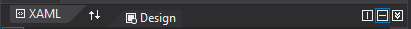
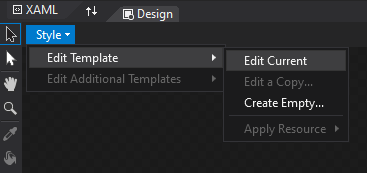
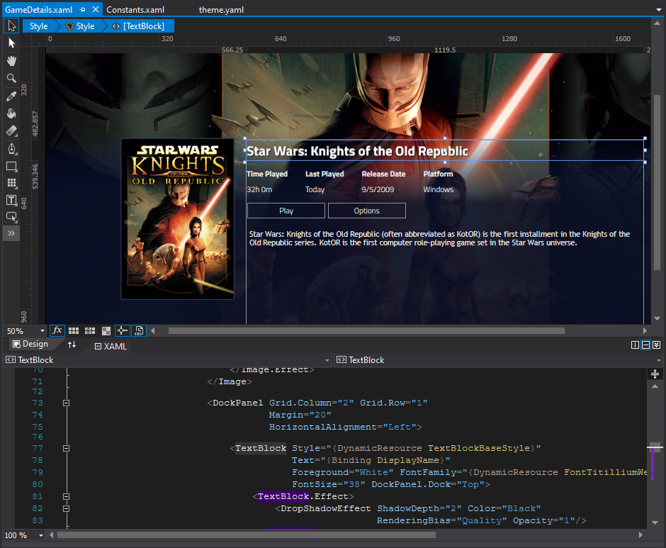

# Creating themes using Blend editor

Installing Blend
---------------------

Blend is part of [Visual Studio IDE](https://visualstudio.microsoft.com/), which is available for free with Community edition. Visual Studio comes with lot of components for workloads you might not be interested in, for theme development you only need `.NET Desktop development` workload.

Creating new theme
---------------------
[Open command prompt](https://www.windows-commandline.com/how-to-open-command-prompt/) and [navigate](https://www.windows-commandline.com/command-prompt-change-directory/) to Playnite's installation folder. To create new theme you need to run `Toolbox.exe` utility with these arguments:

```cmd
Toolbox.exe new desktoptheme|fullscreentheme <ThemeName>
```

For example to create new desktop theme with "Super Clear Modern" name:

```cmd
Toolbox.exe new desktoptheme "Super Clear Modern"
```

This will create new theme folder with all files needed for theme to be edited in Blend. If theme creation is successful then Explorer window will open with your new theme folder. DO NOT move theme's directory, designer in Blend will not work properly unless the theme is opened from the location where Toolbox created it!

> [!NOTE] 
> There might be issues with above examples if you installed Playnite into folder where write access is not enabled by default unless you have elevated privileges (folders like `c:\Program Files`). In that case you will need to run command prompt and Blend with admin privileges. However better approach would be to use different install location.

Editing theme
---------------------

To edit theme in Blend open `Theme.sln` file from theme's directory.

> [!NOTE] 
> Just opening `.sln` file will usually open Visual Studio instead of Blend. While you can use Visual Studio to edit the theme as well, it lacks many features that make editing easier, like live preview for templates and styles. To open `.sln` files in Blend, right-click on the file, select `Open with` and choose `Blend for Visual Studio` option.

> [!WARNING] 
> Due to way Playnite resolves paths to theme files (like images), it is necessary to open theme sln file via the file itself. If you open Blend first and then use it to open the theme sln, some parts of live preview might not work properly. This will be fixed in future Playnite updates.

As a first thing after creating new theme, open `theme.yaml` file and change manifest fields if you need to (you will probably need to change Author at least). For more information about available manifest fields see [manifest file page](manifestFile.md).

### Files

Themes consist of several `.xaml` files. Each view, panel or specific control usually has their own xaml file. Commonly used resources like colors and brushes that affect all controls are generally defined in `Constants.xaml`.

### Live preview

To open live preview (design view):
* Open appropriate style (xaml) file.
* Toggle `Design` view using `Design` tab button.
  * It is highly recommended to keep XAML text view open as well since it's faster for making changes. To have both views open you can split the editor using buttons on bottom right part of the editor (offering both horizontal and vertical split.
  * 

* Select root of the style (line starting with "<Style TargetType=...")
* On design panel select `Style` dropdown then `Edit Template` and lastly `Edit Current`.


Now the preview for the specific control/panel should be visible. Something like this:


Troubleshooting
---------------------

### Fonts, colors and other resources are not applied

Opening style's design view for the first sometimes doesn't properly load referenced resources (like fonts, colors etc). This is a Blend issue and can be fixed easily by editing some part of the style, which will force the design view to reload. Switching to a different file tab and back also resolves this sometimes.

### Updating ThemeFile markup doesn't update in a preview

Specifically declare `RelativePath` property if this happens:
```xml 
<Image Source="{ThemeFile RelativePath='Images/applogo.png'}" />
```
...instead of just:
```xml 
<Image Source="{ThemeFile 'Images/applogo.png'}" />
```

### Design view just doesn't work

This happens if theme is not opened from correct directory. As mentioned above, theme's .sln file must be opened from the directory that Toolbox created it in. Moving to a different directory will cause issues!

Testing changes
---------------------
 
To test theme in Playnite itself, just start Playnite and change theme selection in the application settings. No additional steps should be needed for Playnite to load the theme.

Packaging theme for distribution
---------------------

See [Distribution and Updates](distributionAndUpdates.md) page for more details.

> [!WARNING] 
> Please pay special attention to section about updating themes to make sure your custom theme always works with the latest Playnite version.