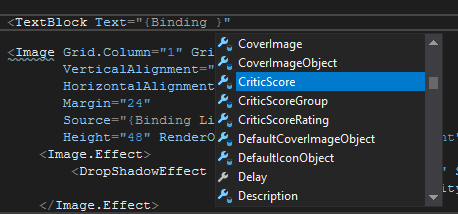

Referencing theme files
---------------------

If you need to reference a file that's part of you theme (for example an image), then you need to use `ThemeFile` markup extension.

For example creating image that uses `applogo.png` file stored in `Images` subfolder would be done this way:

```xml 
<Image Source="{ThemeFile 'Images/applogo.png'}" />
```

Adding video to a theme
---------------------

Use [MediaElement](https://docs.microsoft.com/en-us/dotnet/api/system.windows.controls.mediaelement?view=netframework-4.8) element ([supported formats](https://docs.microsoft.com/en-us/previous-versions/windows/silverlight/dotnet-windows-silverlight/cc189080(v=vs.95)?redirectedfrom=MSDN)) to add a video to a xaml file. Video files by default don't repeat, to automatically repeat playback use `MediaElementBehaviors.Repeat` behavior.

Following example adds video file `video.mp4` stored in `Videos` theme subfolder and plays it on repeat:

```xml 
<MediaElement Source="{ThemeFile 'Videos/video.mp4'}" MediaElementBehaviors.Repeat="True" />
```

What all these PART_ element names
---------------------

You may have seen something like this in theme files:

```xml
<CheckBox x:Name="PART_ToggleFilter" />
```

This notifies theme engine about what kind of checkbox it is and how to hookup functionality for it. If the name is changed or removed then the element will loose all functionality and you will need to set it up in theme file itself via `Binding` markups. You can see PART specifications in appropriate backend file for each control/view (for example [this file](https://github.com/JosefNemec/Playnite/blob/master/source/Playnite.DesktopApp/Controls/Views/GameOverview.cs) for GameOverview view).

This however doesn't mean that you can only include information backed by PART definition in your themes...

Adding additional information to views
---------------------

Not every information, that is available to theme, is always displayed on screen and you may want to display it in your custom theme or completely change how the original information is displayed using PART system. For example `GameDetails.xaml` view from Fullscreen mode theme only shows some game information.

You can display additional information by adding extra elements (TextBoxes, Images etc.) and binding source data to it. When using Blend you can easily see what information is available on particular view by starting typing `Binding` markup, the list of available fields should show up like this:



If it doesn't then you can invoke it via `CTRL-Space` shortcut after typing `Binding`.

Useful data binding docs:
* https://www.wpf-tutorial.com/data-binding/introduction/
* https://docs.microsoft.com/en-us/dotnet/framework/wpf/data/data-binding-wpf

Color definitions
---------------------

You may be wondering why are some colors defined with just 6 digits like `#112233` and other with 8 digits like `#BB112233`. WPF uses RGB system to define color values where each color is defined by values ranging from `00` to `FF` (using [hex](https://simple.wikipedia.org/wiki/Hexadecimal_numeral_system) digits): `#RRGGBB`. However you can also define alpha transparency using additional two digits to specify transparency intensity: `#AARRGGBB`. Where `00` is fully transparent and `FF` is fully opaque.

Using custom controls and 3rd party assemblies
---------------------

The way Playnite currently loads theme files doesn't natively support use of 3rd party assemblies unless they are manually placed in application folder, meaning they can't be distributed inside [pthm](distributionAndUpdates.md) files.

Using custom fonts
---------------------

Limitations of using 3rd party assemblies also apply to use of custom fonts. Currently recommended option is to install desired font in Windows font storage and then use it as any other built-in Windows font in your XAML files.